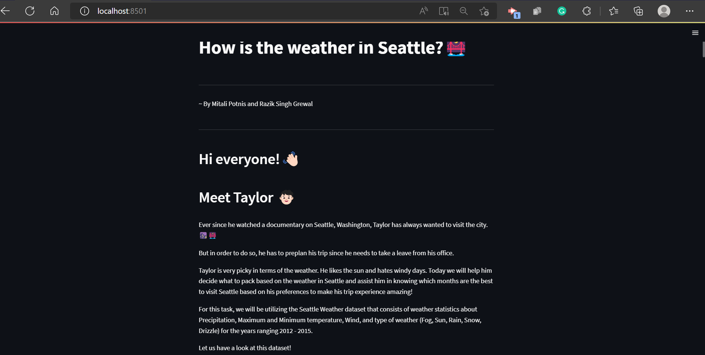

# What is the best time to visit Seattle?

## Project Goals

In this project, we created interactive and compelling visualizations that would help the user decide which months are the best time to visit Seattle and also allow them to get a better idea of the weather conditions observed in the city of Seattle. Therefore, helping them in planning their trip. 

We answer questions like:
What is the average temperature observed in Seattle over the months, and when is it highest or lowest? What is the frequency of these weather observations? If a user wants to experience snow or rainy weather conditions, which months will have the highest chance of such conditions?
Further, we look at the Minimum temperature observed in Seattle and its respective weather phenomena. We also help answer the question of which weather has the highest average speed of the wind. Finally, we compare different quantities of the weather observations to determine: Does it snow a lot in Seattle?

## Design

For the first visualization, wherein we look at the average daily temperature in Seattle, we initially chose to plot a line chart since it will allow us to observe the change in the temperature over a period of time. But we ended up choosing the scatter plot because we wanted the data to reflect the Precipitation information as well. The size of the scatter points can vary with the precipitation data but the same is not possible with a line chart. We also chose the color of the scatter points to vary with the corresponding weather observed. When we hover our cursor over the plot, it will display the weather and the average temperature information.

We then chose a horizontal bar chart to compare the frequency distribution of different weather phenomena. The second plot is a horizontal bar graph linked to the first graph (scatter plot). The data chosen to be plotted in the second graph depends on the area chosen in the scatter plot. We chose a horizontal bar chart since it allows easy comparison of the frequency by comparing the heights of the columns. We have designed the bar chart (weather) so that if we choose a horizontal bar, only the scatter data corresponding to the weather (column) chosen will be plotted in the first scatter plot. Therefore, we have allowed both plots to be linked to each other.

Further, to observe the minimum temperature distributions over the four years, we have built a vertically stacked bar chart comprising the stacking of the minimum temperature values for each year, one above the other. The stacking of the bar chart allows us to compare data between the years easily and the height of the columns allows us to compare the data among each weather. We have also added a horizontal slider that allows the user to choose the minimum temperature, and only those weather observations having their minimum temperature above this value will be plotted.

We employed box plots to examine the minimum, maximum, and median average speeds for each weather. This will help us in deciding which weather is the windiest. Boxplot was chosen since it is easy to read and compare statistical information over different categories. We have also allowed the user to choose for which weather the box plot gets plotted. The colors of the boxes are determined by the weather observed.

Finally, we plot a pie chart to determine how fewer or more snowy days and other weather observations occur. The pie chart allows easy comparison by looking at the area sizes of the pie slices. We have allowed the user to choose the year for which the pie chart is plotted for so that the user can focus on the year of user's choice. We previously though of employing a histogram but chose pie chart over it because it allows easier comparision for the perecentage constituted by each weather.

## Development
In the development process, it took us around 8 hours overall to build the application. The process of Dataset selection and finding effective data which is also good in terms of storytelling took the most time. We would first search for the datasets alone and then come together to discuss the positives and negatives of the datasets we came across. Once the dataset was chosen, we spent time on what questions can be answered and what columns or data will help in answering the same. We then came up with a list of options regarding which plots could we plot which would effectively answer the question in focus. Then we looked at the various interaction and selection techniques that Altair provides. The designing and preparation of the of plots was done by both of us. We made sure that all the questions we had discussed previously were plotted by a plot. The beautification of plots was done after to make the plots look more attractive and to allow the user to easily read and comprehend the plots.

## Success Story

The visualizations plotted were quite helpful to find out different insights about the dataset. The first two plots allow the user to effectively understand what clothes or things to pack and what temperature to expect in each month. Looking at the first two plots, Looking at the two plots, we saw that the months from January to April majorly experience rainy days with some sunny days and ocassional snowy or foggy days. The temperature in such months is on an average around 10 to 25 degree Celsius. This also will allow the user to make out that he will require an umbrella or a raincoat. During the months of April to July, the temperature is seen to rise and these months majorly face sunny days and rainy days (second most observable weather conditions).The temperature is seen to rise in these months with temperature commonly falling in the range of 20 to 35 degree Celsius. The months of July to October (especially August and July) are some of the hottest months with the highest temperature observed in such months being 53.4C and it is also helps the user to understand that he needs to carry an umbrella and light clothes. Finally, during the months from September to December the temperature begins to fall down with rainy days being observed the most and sunny days being the second highest observed days. It will be beneficial for the user to carry a winter coat since these months reach some of the lowest temperatures.

The third plot, the stack vertical bar graph helps us to assert that once the minimum temperature goes above 5.59C it stops snowing or it usually does not snow in Seattle. The drizzle weather stops to get observed after a Minimum Temperature around 16.12C. The foggy weather does not get observed once Minimum Temperature crosses 17.8C. One interesting observation is that a person will still have a chance experience Sunny Days irrespective of the Minimum Temperature. 

As observed in the fourth plot, during drizzle days, the wind speed is quite less ie. between 0.6 to 4.7 m/s, with its median value being 2.1 m/s. The wind speed increases during Foggy days wherein it lies between 0.8 to 6.6 m/s and its median speed being 2.4 m/s During Rainy days, the wind spped even increases more to a range between 0.5 to 9.5 m/s with a 3.4 m/s median speed of wind.Compared to rainy days, snowy days tend to have higher average speed of wind with a 4.95 m/s median wind speed and the wind usually being in between the range 1.6 to 7 m/s. Finally, for sunny days, the wind speed is again low with a median speed of 2.8 m/s.
From this, we can deduce that if a person wants to avoid windy days, he needs to visit Seattle in the months wherein there is no snowfall. From the previous plots, we observed that the phenomena of snow is less commonly observed during the months from April to November. So this time is a good fit for the person to visit Seattle!

Finally, the Pie chart aloows us to answer the question of does it snow much in Seattle. After looking at the pie chart for different years, we can see that snowy days constitute one of the smallest if not least percentage in terms of observations. One interesting observation is that it did not even snow in 2015. In all the years the number of sunny and rainy days is almost equal or the number of sunny days is just a bit more than that of the raainy days. The drizzle weather was not observed even once during year 2014.

In conclusion, the visualizations plotted by us assist us in answering different questions which would help the user to not only know about the weather conditions but also help him to look at different information relating to Precipitation, Wind, and Temperatures.
